# Vue 组件树构建的流程

## 文字描述

1. 初始化组件实例，如果存在 `vm.el` 自动执行组件的的 `mount` 方法
2. 执行`new Watcher(vm, updateComponent, noop, function before(){})`，初始化实例的渲染 watcher
3. watcher 执行`value = this.getter.call(vm, vm)`计算它的初始值，而 `this.getter` 就是 `updateComponent` 方法，也就是`vm._update(vm._render())`
4. `vm._render()`返回此组件的 VNode 树，使用`createElement(componentOptions | tagName, data, children)`返回每个元素的 VNode，对于普通元素，直接返回`new VNode(tagName, data, children)`，对于子组件将执行 `createComponent` 方法，返回安装了 snabbdom 钩子（init、prepatch、insert 和 destroy）的`new VNode('vue-component-{uid}-{name}', data, children)`
5. 接下来继续执行 `updateComponent` 的`vm._update(vm._render())`，进入了 `update` 方法
6. 首次 update，执行`patch(vm.$el, VNode)`，再执行 `createElm` 方法，按照 VNode 创建对应的 dom 且将它赋值给 $el
7. `createElm` 方法会创建组件的根元素 dom，且执行 `createChildren` 来递归它，每个创建出来的 dom 挂载到 VNode 的 elm 上
8. 如果遇到普通 VNode，执行 `createElm` 将其转成 dom，且挂载到 `VNode.elm`，如果遇到组件 VNode，执行 `createComponent` 方法，执行 `VNode.data.init` 钩子，执行 `createComponentInstanceForVnode` 方法对 `VNode.componentOptions` 进行组件实例化，确定组件的父子关系引用，将此实例挂载到 `VNode.componentInstance`，再手动执行此实例的 `mount` 方法，回到步骤`2`，将得到的此组件 $el 赋值给 VNode 的 elm，最终将此 elm 使用`appendChild`插入到父组件的 elm
9. 如此，自定义组件就被组合进了父组件
10. 如果数据发生了变化，渲染 watcher 将重新执行`vm._update(vm._render())`，得到最新的 VNode，且进入 update，执行 `patch(oldVNode, newVNode)`，对全部的 VNode 节点执行 patchVNode
11. patchVNode 新旧 VNode 时，会执行它的 prepatch 钩子，将 `oldVNode.componentInstance` 赋值给了 newVNode（从而维持着组件实例），且执行 `updateChildComponent` 方法，将新 VNode 的 props、attrs、listeners 和 children 赋值给组件实例，如果值不同，自然而然就触发了子组件的 update
12. 如此往复

## 流程图描述

> for more detail for flowchart of mermaid in markdown, see: https://mermaid-js.github.io/mermaid/#/flowchart

```mermaid
flowchart TD
  subgraph "首次渲染"
    initInstance["初始化实例"]
    initInstance --> isRootComponent{"是否存在`vm.el`"}
    doMount["执行实例的mount方法"] --> initRenderWatcher["初始化实例的渲染watcher"] --> updateComponentOnFirst["首次执行updateComponent方法"] --> doRenderAndGetVNodeTree["执行render方法得到组件的VNode树"]
    initInstanceReturn["返回实例"]
    returnVNode["返回VNode"]
    isRootComponent -->|是| doMount --> initInstanceReturn
    isRootComponent -->|否| initInstanceReturn
    doRenderAndGetVNodeTree --> doRenderAndGetVNodeTree_a1["普通dom元素"] --> doRenderAndGetVNodeTree_a2["执行`new VNode(tagName, data, children)`"] --> returnVNode
    doRenderAndGetVNodeTree --> doRenderAndGetVNodeTree_b1["子组件"] --> doRenderAndGetVNodeTree_b2["执行createComponent"] --> doRenderAndGetVNodeTree_b3["执行`new VNode('vue-component-{uid}-{name}', data, children)`"] --> doRenderAndGetVNodeTree_b4["对此VNode安装init、prepatch、insert和destroy钩子"] --> doRenderAndGetVNodeTree_b5["将componentOptions保存到此VNode"] --> returnVNode
    returnVNode --> doUpdate["继续执行updateComponent剩下的update方法"] --> doPatchOnFirst["执行patch(vm.el, VNode)"] --> doCreateElm["执行createElm方法"] --> createRootDom[创建根dom元素] --> doCreateChildren["执行createChildren方法递归此VNode"]
    doCreateChildren --> doCreateChildren_a1["普通VNode"] --> doCreateChildren_a2["把此VNode转换成真实的dom"] --> bindDomToVNodeAndReturn
    doCreateChildren --> doCreateChildren_b1["组件VNode"] --> doCreateChildren_b2["执行createComponent方法"] --> doCreateChildren_b3["执行VNode.data.init钩子"] --> doCreateChildren_b4["执行createComponentInstanceForVnode方法"] --> doCreateChildren_b5["根据VNode.componentOptions初始化组件实例"] --> manualDoMount["手动执行实例的mount方法"] --> doMount --> insertDomToParent["将dom插入到父dom"] --> bindDomToVNodeAndReturn
    bindDomToVNodeAndReturn["将此dom挂载到VNode.elm且返回VNode"] --> compositionDone[父子组件的组合完成]

  end
  subgraph "每次更新导致的重新渲染"
    dependencesChanged["依赖改变"] --> renderWatcherInvoke["渲染watcher重新执行"] --> updateComponent["执行组件的updateComponent方法"] --> doPatch["执行patch(oldVNode, newVNode)"] --> doPatchVNode["对每个VNode执行patchVNode"] --> doPrepatchHook["执行prepatch钩子，将oldVNode.componentOptions赋值给newVNode"] --> doUpdateChildrenComponent["执行doUpdateChildrenComponent，将props、attrs、listeners和children赋值给实例"] --> isComponentStateChanged{子组件状态是否发生改变}
    isComponentStateChanged -->|是| dependencesChanged
    isComponentStateChanged -->|否| patchVNodeEnd["patchVNode结束"]

  end
```

